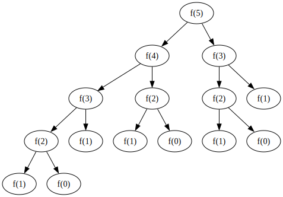

# 搜索剪枝和记忆化搜索

## 介绍
搜索是非常基础的算法，在很多题目里都会用到。但是，朴素的搜索算法的时间复杂度比较高，在使用的时候一般会进行优化。其中，比较常用的两种方法就是**搜索剪枝**和**记忆化搜索**。

## 记忆化搜索

### 例子：斐波那契数列的计算

斐波那契数列的定义
$$
F_n = 
    \begin{cases}
        0 & n=0 \\
        1 & n=1 \\
        F_{n-1} + F_{n-2} & n \geq 2
    \end{cases}
$$

使用递归的方法计算

```cpp
#include <bits/stdc++.h>
using namespace std;
// 斐波那契数列，n需要大于或等于0
size_t fb(size_t n)
{
    if (n <= 1)
    {
        // f(0) = 0, f(1) = 1
        return n;
    }
    else
    {
        return fb(n - 1) + fb(n - 2);
    }
}
int main()
{
    size_t n;
    while (cin >> n)
    {
        auto ans = fb(n);
        cout << "fb(" << n << ") = " << ans << "\t";
    }
}
```

添加计时函数的运行结果
```
4
fb(4) = 3       time = 4.48e-07s

8
fb(8) = 21      time = 1.076e-06s

16
fb(16) = 987    time = 2.1061e-05s

32
fb(32) = 2178309        time = 0.0165524s

40
fb(40) = 102334155      time = 0.557004s

44
fb(44) = 701408733      time = 3.77572s

45
fb(45) = 1134903170     time = 6.11861s
```

可以发现运算的速度很慢，稍微大一点的n都要很长时间。为什么会这么慢呢？

以计算 $n = 5$ 为例，递归方法需要计算进行下图的计算


可以看到，在递归的过程中，进行了很多重复的运算。这种方法有指数级的时间复杂度

容易想到，如果在计算的过程中，用数组把计算的中间过程的结果记录下来，就可以避免重复的计算了。

```cpp
#include <bits/stdc++.h>
using namespace std;
// 记忆化数组
size_t arr[10000];
// 斐波那契数列，n需要大于或等于0
size_t fb(size_t n)
{
    if (n <= 1)
    {
        // f(0) = 0, f(1) = 1
        return n;
    }
    else
    {
        // 当数组内的值没有被计算，才进行计算
        if (arr[n] == 0)
            arr[n] = fb(n - 1) + fb(n - 2);
        return arr[n];
    }
}
int main()
{
    size_t n;
    while (cin >> n)
    {
        auto ans = fb(n);
        cout << "fb(" << n << ") = " << ans << "\t";
    }
}
```

添加计时函数的运行结果
```
45
fb(45) = 1134903170     time = 1.23e-06s

1024
fb(1024) = 17158967189505497659 time = 6.5803e-05s

9999
fb(9999) = 2788724563990792802  time = 0.000628778s
```

可以看到，运算的速度快了很多。这种方法的时间复杂度降到了 $O(N)$

### 记忆化搜索的思想
用递归的方法计算，时间复杂度高的原因是因为同一个状态，会被重复的访问和计算。

如果把中间过程的值存储下来，在下次访问的时候直接来使用，就可以避免进行重复的计算了。这种思想就是记忆化搜索的思想。

这是一种**以空间换时间**的方法，对有大量**重复**出现**子问题**的问题的时间复杂度有较大的提升（比如说动态规划的问题）

### 例题 [P1434 [SHOI2002] 滑雪](https://www.luogu.com.cn/problem/P1434)

#### 解题思路

如果遍历每一个点，从这个点进行一次 $dfs$ ，在四个方向中，可以去的点的最大滑行距离中，取最大值，就可以递归得出答案。但是这样的时间复杂度太大。发现每个点开始最大滑行距离都是固定的，可以考虑用数组存起来，这样每个点的最大滑行距离就只用被计算一次。

#### 代码

```cpp
#include <bits/stdc++.h>
using namespace std;
#define max_len 110
// 存放高度的数组
int arr[max_len][max_len];
// 是否访问过
bool is_visit[max_len][max_len];
// 每个点的最长的滑雪的长度
int max_sklen[max_len][max_len];

int R, C;
// 检查参数
bool check_xy(int x, int y)
{
    if (x >= R || x < 0 || y >= C || y < 0)
        return false;
    else
        return true;
}
// 搜索的函数
int dfs(int x, int y)
{
    if (check_xy(x, y) == false)
        return 0;
    // 如果已经访问过，就说明已经被计算过，可以直接返回。
    else if (is_visit[x][y] == true)
        return max_sklen[x][y];
    else
    {
        // 上下左右如果满足条件，则分别进行搜索
        int max_sk = 0;
        if (check_xy(x + 1, y) == true && arr[x + 1][y] < arr[x][y])
            max_sk = max(dfs(x + 1, y) + 1, max_sk);

        if (check_xy(x - 1, y) == true && arr[x - 1][y] < arr[x][y])
            max_sk = max(dfs(x - 1, y) + 1, max_sk);

        if (check_xy(x, y + 1) == true && arr[x][y + 1] < arr[x][y])
            max_sk = max(dfs(x, y + 1) + 1, max_sk);

        if (check_xy(x, y - 1) == true && arr[x][y - 1] < arr[x][y])
            max_sk = max(dfs(x, y - 1) + 1, max_sk);

        // 记忆化数组的存储
        is_visit[x][y] = true;
        max_sklen[x][y] = max_sk;
        return max_sk;
    }
}
int main()
{
    cin >> R >> C;
    for (int i = 0; i < R; i++)
        for (int j = 0; j < C; j++)
            cin >> arr[i][j];

    int max_can_sk = 0;
    // 需要遍历每一个点进行一次搜索
    // 由于进行了记忆化，总共的搜索次数也只是O(n^2)
    for (int i = 0; i < R; i++)
        for (int j = 0; j < C; j++)
            max_can_sk = max(dfs(i, j), max_can_sk);

    cout << max_can_sk + 1 << endl;
}
```

### 方法

一般来说，使用记忆化搜索的步骤如下:
1. 判断状态的个数（可不可以用记忆化）
2. 写出朴素的搜索
3. 改为**不需要**外部变量的搜索（结果仅由参数决定）
3. 添加记忆化数组

一般模板如下:
```cpp
// 定义记忆化数组
// 维度和参数一样
数据类型 arr[s1][s2][s3][...];
// 斐波那契数列，n需要大于或等于0
数据类型 func(a1, a2, a3, ...)
{
    if (超过边界条件)
    {
        return;
    }
    else
    {
        // 当数组内的值没有被计算，才进行计算
        // 一般为0是没被计算过的
        // 如果状态的结果可能为0
        // 可以初始化为其他不可能出现的数，比如-1
        // 也可以专门建立一个数组来存是否已经计算过
        if (arr[a1][a2][a3][...]还没被计算)
            arr[a1][a2][a3][...] = 所计算值;
        return arr[a1][a2][a3][...];
    }
}
```

### 注意

#### 无后效性

对于每一个状态，所得出的结果和前一个状态、后一个状态都**无关**。也就是说，每**一组**参数仅对应**一个**结果。

#### 子问题互相依赖

要注意分割出的子问题**不可以**互相依赖，就比如计算 $f(x)$ 的时候使用了$f(y)$ ，那么计算 $f(y)$ 的时候就不能出现 $f(x)$ ，也就是说，搜索的时候**不能**出现**环**。

## 搜索剪枝

如果暴力的搜索的时间复杂度太大，可以考虑把**不会**成为最后答案的方法去除，这种优化方法一般叫做“剪枝”。

### $BFS$ 中剪枝的方法

在 $BFS$ 中比较常见的剪枝的方法是判重。一般 $BFS$ 的题目都是求最优解的，如果一个状态之前就出现过了，之后再出现的时候就不会比上次出现的时候更优了，所以可以不用搜索了。

### 例题 [[USACO1.4] [IOI1994]时钟 The Clocks](https://www.luogu.com.cn/problem/P1213)

#### 题目思路

每个时钟都有4个状态，一共9个时钟。有9种移动的方式。如果直接用 $BFS$ 搜索的话，在队列的状态的数量是随步骤的增加而**指数级**增长的。观察发现，这些时钟的状态一共有 $4^9 = 262144$ 种，是一个比较小的数，所以考虑用数组把每个状态的最小的到达的步骤存下来，使用 $BFS$ 从移动方式1开始到9，每个状态第一次到达的时候都是最优的。因为要输出移动的顺序，可以新开一个数组存每个状态的上一个状态。

``` cpp
#include <bits/stdc++.h>
using namespace std;
#define max_len ((1 << 20) + 10)
// 所有的时钟，可以用一个整数存
// 每2位可以看成一个时钟的四种状态
// 一共用了18位
struct all_clock
{
    // 低位的时钟存到数字的低位
    int n;
    // 得到第i个时钟的值
    int get_i_clock(int i)
    {
        return (n >> (i * 2)) % 4;
    }
    // 设置第i个时钟的值
    void set_clock(int i, int val)
    {
        // 先把当前位的清零
        n &= ~(0x3 << (i * 2));
        n ^= (val << (i * 2));
    }
};

// 移动一个时钟
void mov_clock(all_clock &ac, int ck)
{
    ac.set_clock(ck, (ac.get_i_clock(ck) + 1) % 4);
}

// 移动所有的时钟
all_clock move_a_step(all_clock ac, int op)
{
    switch (op)
    {
    case 1:
        mov_clock(ac, 0);
        mov_clock(ac, 1);
        mov_clock(ac, 3);
        mov_clock(ac, 4);
        break;
    case 2:
        mov_clock(ac, 0);
        mov_clock(ac, 1);
        mov_clock(ac, 2);
        break;
    case 3:
        mov_clock(ac, 1);
        mov_clock(ac, 2);
        mov_clock(ac, 4);
        mov_clock(ac, 5);
        break;
    case 4:
        mov_clock(ac, 0);
        mov_clock(ac, 3);
        mov_clock(ac, 6);
        break;
    case 5:
        mov_clock(ac, 1);
        mov_clock(ac, 3);
        mov_clock(ac, 4);
        mov_clock(ac, 5);
        mov_clock(ac, 7);
        break;
    case 6:
        mov_clock(ac, 2);
        mov_clock(ac, 5);
        mov_clock(ac, 8);
        break;
    case 7:
        mov_clock(ac, 3);
        mov_clock(ac, 4);
        mov_clock(ac, 6);
        mov_clock(ac, 7);
        break;
    case 8:
        mov_clock(ac, 6);
        mov_clock(ac, 7);
        mov_clock(ac, 8);
        break;
    case 9:
        mov_clock(ac, 4);
        mov_clock(ac, 5);
        mov_clock(ac, 7);
        mov_clock(ac, 8);
        break;
    }
    return ac;
}

// 每一个状态最小的步骤数
int status_step[max_len];
// 上一个状态
int status_pre_s[max_len];
// 上一个状态到现在的状态
// 需要走的步骤
int status_op[max_len];

// bfs
// 对于每个状态，遍历所有可能的下一步
// 如果没有被搜索过，就加入队列
int bfs(all_clock beg_status)
{
    status_step[beg_status.n] = 1;
    queue<all_clock> que_status;
    que_status.push(beg_status);
    while (que_status.size() != 0)
    {
        auto now_status = que_status.front();
        que_status.pop();
        for (int i = 1; i <= 9; i++)
        {
            auto next_status = move_a_step(now_status, i);

            // 如果没有到达过这个状态
            // 才加入队列
            if (status_step[next_status.n] == 0)
            {
                que_status.push(next_status);
                status_step[next_status.n] = status_step[now_status.n] + 1;
                status_pre_s[next_status.n] = now_status.n;
                status_op[next_status.n] = i;
                // 如果搜到了，就直接返回
                if (next_status.n == 0)
                {
                    return status_step[now_status.n] + 1;
                }
            }
        }
    }
    return status_step[0];
}

// 输出经过的步骤
void print_op()
{
    int ac_i = 0;
    stack<int> stk;
    for (int i = 1; i < status_step[0]; i++)
    {
        // 把上个状态到这个状态的
        // 操作加入栈
        stk.push(status_op[ac_i]);
        // 到上个状态
        ac_i = status_pre_s[ac_i];
    }
    while (stk.size() != 0)
    {
        cout << stk.top();
        stk.pop();
        if (stk.size() != 0)
        {
            cout << " ";
        }
    }

    cout << endl;
}

int main()
{
    all_clock ac;
    ac.n = 0;
    for (int i = 0; i < 9; i++)
    {
        int val;
        cin >> val;
        ac.set_clock(i, (val / 3) % 4);
    }
    bfs(ac);
    print_op();
}
```


### $DFS$ 中剪枝的方法

$DFS$ 中常见的剪枝方法有**记忆化搜索**、**最优性**剪枝、**可行性**剪枝

1. 记忆化搜索

如果相同的参数得出的结果相同，可以把结果用数组存起来。

2. 最优性剪枝

如果当前（可能还没搜索完）的结果已经比之前搜出来的结果要差的时候，就可以不再往下搜了。

```cpp
数据类型 ans = 当前的解（或最坏情况、无解的标记）
void dfs(参数)
{
    if(现在的解不比ans好) return;
    if(到达终点) ans = ans和当前解选更好的;
    for (遍历所有可能)
    {
        if (可行)
        {
            进行操作;
            dfs(缩小规模);
            撤回操作;
        }
    }
}
```

3. 可行性剪枝

如果当前已经不满足条件，无法到达解的状态时，就不用再继续搜索了。

```cpp
数据类型 ans = 当前的解（或最坏情况、无解的标记）
void dfs(参数)
{
    if(当前已经无法到达解的状态) return;
    if(到达终点) ans = ans和当前解选更好的;
    for (遍历所有可能)
    {
        if (可行)
        {
            进行操作;
            dfs(缩小规模);
            撤回操作;
        }
    }
}
```

剪枝的思路和具体的问题有关。一般来说，在正确的情况下，剪枝剪得越多越好。最好可以用上所有想到的剪枝的方法。

剪枝的时间复杂度比较难计算，和数据、搜索的顺序都有关系。所以一道搜索题 $TLE$ ，除了可能剪枝剪得不够，还有可能是搜索顺序（一般来说，从数字大的、信息多的、更有可能成为答案的地方开始搜会更好）、题目数据（构造过的数据）的问题。当然也可能是需要其他的优化，甚至是题目本身的问题。

### 例题 Almost Arithmetic Progression [洛谷](https://www.luogu.com.cn/problem/CF978D) [codeforces](https://codeforces.com/problemset/problem/978/D)

#### 解题思路

可以使用dfs，对于每个数，分别 $+1,-1,0$ ，从第三个数字开始，判断与上一个数的差是否等于数列的公差，公差为第一、二个数的差。如果不相等，之后也不会产生答案，这部分就可以不搜索了。如果搜完了整个数列，就说明这是等差数列，可以更新操作次数。在搜索的过程中，如果操作次数大于等于之前的答案，这部分也可以不搜索了。

```cpp
#include <bits/stdc++.h>
using namespace std;
#define max_len 100100
// 原始的数
int arr[max_len];
// 最小改变次数
int min_change = -1;
int N;
// 参数分别为
// ni:当前的下标
// l1:上一个数
// l2:上两个数
// change_num:改变的次数
void dfs(int ni, int l1, int l2, int change_num)
{
    // 当前的改变次数已经比之前的更多了，返回
    if (min_change != -1 && change_num >= min_change)
        return;

    // 到达了第N个，更新最小改变次数
    if (ni >= N)
    {
        if (min_change == -1)
            min_change = change_num;
        else
            min_change = min(min_change, change_num);
    }
    else
    {
        // 第三个数之后
        if (l1 != -1 && l2 != -1)
        {
            int diff = l1 - l2;
            // 判断两者差值的绝对值是否小于等于1
            // 是的话就可以搜下一个了
            if (abs(l1 + diff - arr[ni]) <= 1)
            {
                // 不用改，可以直接搜下一个
                if (l1 + diff == arr[ni])
                    dfs(ni + 1, arr[ni], l1, change_num);

                else if (l1 + diff == arr[ni] + 1)
                    dfs(ni + 1, arr[ni] + 1, l1, change_num + 1);

                else if (l1 + diff == arr[ni] - 1)
                    dfs(ni + 1, arr[ni] - 1, l1, change_num + 1);
            }
        }
        // 第一、二个数，直接往下搜
        else
        {
            dfs(ni + 1, arr[ni], l1, change_num);
            dfs(ni + 1, arr[ni] - 1, l1, change_num + 1);
            dfs(ni + 1, arr[ni] + 1, l1, change_num + 1);
        }
    }
}
int main()
{
    cin >> N;
    for (int i = 0; i < N; i++)
        cin >> arr[i];

    dfs(0, -1, -1, 0);
    cout << min_change << endl;
}
```

## 题单

| 序号  | 题号      | 标题                                  | 题型          | 难度评级  |
|-------|-----------|---------------------------------------|---------------|-----------|
| 1     | P1464     | Function                              | 记忆化搜索    | ⭐        |
| 2     | P1434     | [SHOI2002] 滑雪                       | 记忆化搜索    | ⭐        |
| 3     | P3183     | [HAOI2016] 食物链                     | 记忆化搜索    | ⭐⭐        |
| 4     | P1025     | [NOIP2001 提高组] 数的划分            | 搜索剪枝      | ⭐⭐        |
| 5     | P1036     | [NOIP2002 普及组] 选数                | 搜索剪枝      | ⭐⭐        |
| 6     | P1213     | [USACO1.4] [IOI1994]时钟 The Clocks   | bfs、搜索剪枝 | ⭐⭐⭐        |
| 7     | P1544     | 三倍经验                              | 记忆化搜索    | ⭐⭐        |
| 8     | B3624     | 猫粮规划                              | 搜索剪枝      | ⭐⭐        |
| 9     | P1535     | [USACO08MAR] Cow Travelling S         | 记忆化搜索    | ⭐⭐        |
| 10    | ABC085C   | Otoshidama                            | 搜索剪枝      | ⭐⭐        |
| 11    | CF978D    | Almost Arithmetic Progression         | 搜索剪枝      | ⭐⭐        |

## 参考

* https://oi.wiki
* https://zh.cppreference.com
* https://github.com/CSGrandeur/s-1problem1day1ac/discussions/551 DM1-1 2023寒期集训 搜索剪枝，记忆化搜索