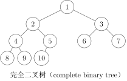

# 树

## 介绍

树是一种常用的数据结构，就像现实中的树一样，不过在处理问题的时候一般把根放在上方。

## 相关的概念

### 度数

与一个顶点 $v$ 关联的边的条数称作该顶点的**度**。

### 根结点

是树的最初的结点。一个非空的树有唯一的根结点。

有些树没有固定的根结点，这种树叫做**无根树**。
无根树可以看成一个有 $n$ 个结点， $n-1$ 条边的连通无向图。

无根树指定一个结点为根，就形成了一棵**有根树**。

### 森林

每个连通块都是树的图。一棵树也是森林。

### 生成树

一个连通无向图的生成子图，同时要求这个子图是树。
也就是在图的边中选择 $n-1$ 条，并且能使所有顶点连通。

### 叶结点

* **无根树的叶结点**：度数不超过1的结点
* **有根树的叶结点**：没有子结点的结点

### 有根树的相关概念

* **父结点**：除根结点外，定义为该节点到根的路径上的下一个节点。
* **子结点**：如果 $u$ 是 $v$ 的父亲，则 $v$ 是 $u$ 的子结点。
* **结点的深度**：该结点到根的路径上的边的数量
* **树的高度**：根结点的深度
* **子树**：删去与父结点相连的边和父结点所在的子图后，剩下的子图


## 树的种类

* **二叉树**：每个结点最多只有两个子结点的有根树称为**二叉树**，
常根据子结点的顺序分为**左子结点**和**右子结点**。

* **完全二叉树**：只有最下面两层的结点度数小于2，
且最下面一层的结点都集中在该层最左边开始的连续位置上。




* **满二叉树**：所有叶子结点的深度都相同，且非叶子结点的子结点数量均为2的二叉树
称作满二叉树（完美二叉树）。


## 树的储存

### 临接表

如果是无根树，可以记录每个结点所连接的结点。

```cpp
struct tree_node
{
    list<int> linked;
} node_arr[max_len];
```

对于有根树，可以记录所有的子结点。
如果需要，可以额外记录父结点。

```cpp
struct tree_node
{
    list<int> children;
    int parent;
} node_arr[max_len];
```

### 二叉树

可以记录每个结点的两个子结点。
如果需要可以记录父结点。

```cpp
struct tree_node
{
    int lch, rch;
    int parent;
} node_arr[max_len];
```

## 遍历

遍历有dfs（深度优先搜索）和bfs（广度优先搜索）。

### 二叉树的dfs遍历

#### 前序遍历

按照**根-左子结点-右子结点**遍历二叉树。

```cpp
void preorder(int rooti)
{
    if(rooti != 0)
    {
        visit(rooti);
        preorder(node_arr[rooti].lch);
        preorder(node_arr[rooti].rch);
    }
}
```


#### 中序遍历

按照**左子结点-根-右子结点**遍历二叉树。

```cpp
void inorder(int rooti)
{
    if(rooti != 0)
    {
        inorder(node_arr[rooti].lch);
        visit(rooti);
        inorder(node_arr[rooti].rch);
    }
}
```


#### 后序遍历

按照**左子结点-右子结点-根**遍历二叉树。

```cpp
void postorder(int rooti)
{
    if(rooti != 0)
    {
        postorder(node_arr[rooti].lch);
        postorder(node_arr[rooti].rch);
        visit(rooti);
    }
}
```


#### 反推

根据**中序遍历**序列和另一个遍历序列可以反推第三个序列和树的结构。

以**前序遍历**和**中序遍历**为例：
**前序遍历**序列的结构是 `|根|左子树|右子树|` ，
**中序遍历**序列的结构是 `|左子树|根|右子树|` ，
因此根据**前序遍历**可以知道根的下标，
在**中序遍历**中就可以得到左子树和右子树的结点数量，
然后就可以向下递归。


### 树的bfs遍历

#### 层次遍历

从根结点开始，一层一层地横向遍历各个结点。
在遍历的时候可以记录遍历的层数。

* 代码

```cpp
#include <queue>
#include <list>
#include <iostream>
using namespace std;

struct tree_node
{
    list<int> children;
} node_arr[10000];

void levelorder(int rooti)
{
    // node, level
    queue<pair<int, int>> que;
    que.push(make_pair(rooti, 0));
    while (que.size() != 0)
    {
        auto [node_i, lv] = que.front();
        que.pop();
        // 访问结点
        cout << node_i << " "
             << lv << "\n";

        for (auto chi : node_arr[node_i].children)
        {
            que.push(make_pair(chi, lv + 1));
        }
    }
}

int main()
{
    int N;
    cin >> N;
    for(int i = 1; i <= N; i++)
    {
        int K;
        cin >> K;
        for (int j = 0; j < K; j++)
        {
            int tmp;
            cin >> tmp;
            node_arr[i].children.push_back(tmp);
        }
    }
    levelorder(1);
}
```

输入一棵以1为根结点的树。
第一行结点个数 $N$ ，
第2行到第 $N+1$ 行：每个结点子结点个数、子结点序列

* 输入
<pre>
8
3 3 5 6
0
1 2
1 8
0
2 4 7
0
0
</pre>

* 输出
<pre>
1 0
3 1
5 1
6 1
2 2
4 2
7 2
8 3
</pre>

* 输入的树


### 无根树的dfs遍历

由于无根树没有固定的根结点，需要指定一个根结点开始遍历。
因为树是无环图，所有只需要记录每个结点从哪里来（父结点），
进入子结点时排除父结点，就可以避免重复访问。

* 代码

```cpp
#include <queue>
#include <list>
#include <iostream>
using namespace std;

struct tree_node
{
    list<int> linked;
} node_arr[10000];

void dfs(int rooti, int from)
{
    cout << rooti << "\n";
    for (auto chi : node_arr[rooti].linked)
    {
        if (chi != from)
        {
            dfs(chi, rooti);
        }
    }
}

int main()
{
    int N;
    cin >> N;
    for (int i = 0; i < N - 1; i++)
    {
        int v, u;
        cin >> v >> u;
        node_arr[v].linked.push_back(u);
        node_arr[u].linked.push_back(v);
    }
    dfs(1, -1);
}
```

输入第一行为结点的个数 $N$
下面 $N-1$ 行每行有两个数 $u, v$
表示 $u, v$ 间有一条边。

* 输入
<pre>
5
2 3
5 1
4 2
2 1
</pre>

* 输出
<pre>
1
5
2
3
4
</pre>

* 输入的树


## 题单

| 序号  | 题号            | 标题                                   | 题型                                | 难度评级  | 题解                   |
|-------|-----------------|----------------------------------------|-------------------------------------|-----------|:-----------------------|
| 1     | luogu-P5908     | 猫猫和企鹅                             | 树、遍历、dfs                       | ⭐        |[👍](sol/P5908/sol.md)   |
| 2     | luogu-P4913     | 【深基16.例3】二叉树深度               | 二叉树、遍历                        | ⭐        |[👍](sol/P4913/sol.md)   |
| 3     | luogu-P1364     | 医院设置                               | 二叉树、遍历、枚举                  | ⭐⭐      |[👍](sol/P1364/sol.md)   |
| 4     | luogu-P1827     | [USACO3.4] 美国血统 American Heritage  | 二叉树、遍历                        | ⭐⭐⭐     |[👍](sol/P1827/sol.md)   |
| 5     | luogu-P4715     | 【深基16.例1】淘汰赛                   | 二叉树、模拟                        | ⭐⭐⭐     |[👍](sol/P4715/sol.md)   |
| 6     | luogu-P1229     | 遍历问题                               | 二叉树、遍历、递归、分类讨论、计数  | ⭐⭐⭐⭐   |[👍](sol/P1229/sol.md)    |
| 7     | POJ-3253        | Fence Repair                           | 二叉树、贪心                        | ⭐⭐⭐    |[👍](sol/POJ-3253/sol.md) |
| 8     | UVA122          | Trees on the level                     | 二叉树、层次遍历                    | ⭐⭐⭐    |[👍](sol/UVA122/sol.md)   |
| 9     | UVA548          | Tree                                   | 二叉树、遍历                        | ⭐⭐⭐⭐   |[👍](sol/UVA548/sol.md)   |

## 参考
* [图论相关概念](https://oi-wiki.org/graph/concept/)
* [树基础](https://oi-wiki.org/graph/tree-basic/)